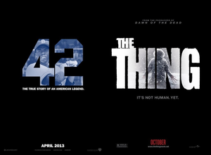
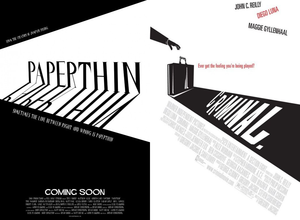

# Overview

Unsupervised clustering of movie posters with features extracted from Convolutional Neural Network. Visualization using d3js.

This project is divided into 3 main scripts:
* get_posters.py
  * retrieve the posters from impawards.com.
  * create a thumbnail for each posters for the visualization.
* get_features_from_cnn.py
  * extract the last full-connected layer of size 4096 of VGG-16 [paper](https://arxiv.org/abs/1409.1556)
* get_data_visu.py
  * dimension reduction for data-visualization
  * first PCA reduction then t-SNE to convert the 4096 dimensions features into a 2 dimensions features
  * t-SNE: [paper](http://jmlr.org/papers/volume9/vandermaaten08a/vandermaaten08a.pdf)
  * t-SNE: [tutorial on t-SNE](http://distill.pub/2016/misread-tsne/)

To get parameters descriptions:
* python get_XXX.py --help

# Setup

## Requirements

### OS
* Linux/Unix/OSX (requirement for wget)
* Python 3.3+
* ImageMagick

### Packages Python
* BeautifulSoup 4.4
* [Tensorflow 1.0](https://www.tensorflow.org/install/)
* Keras
* Pandas
* pickle
* urllib
* sklearn
* numpy
* h5py
* PIL
* [Multicore-TSNE](https://github.com/DmitryUlyanov/Multicore-TSNE)

## Installation

Download the VGG-16 weights: [vgg16_weights.h5](https://drive.google.com/file/d/0Bz7KyqmuGsilT0J5dmRCM0ROVHc/view?usp=sharing)

```sh
$ git clone https://github.com/aDrz/movie-posters-convnet.git
```

# Usage

## Computation
After cloning you can just launch the bash script that will:
* download posters from 1920 to 2016
* compute features
* perform dimensional reduction on features of 3000 randomly choosen posters

```sh
$ chmox +x run-posters-cnn.sh
$ ./run-posters-cnn.sh
```

Then grab a coffee...

## Visualization
First install a HTTP server (webfsd):
```sh
$ sudo apt-get install webfsd
```

Then launch index.html into your favorite browser:
```sh
$ chromium 127.0.0.1:8000/index.html?data.json
```


## Results
Cherry-piking from the top-200 closest couple of posters (relative to cosine distance):

<div align = 'center'>




</div>
## License

This project is licensed under the MIT License - see the [LICENSE.md](LICENSE.md) file for details

## Acknowledgments

* d3js plot: from [https://github.com/douglasbagnall/image-tsne](https://github.com/douglasbagnall/image-tsne)